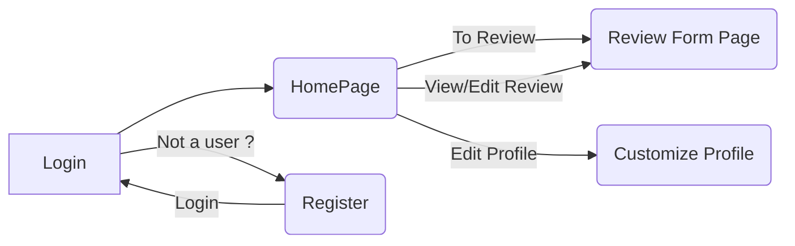

# NITCONF  RMS

It is a system which helps program committee to decide whether  to accept paper for a conference based on reviews given by reviewers. It gives us a categorized review based on different aspects of a paper. 

## Login 

 Already registered reviewers can **login** using their login credentials. 
 
 Login credentials required to login page:
 - username/email
 - password

 Forgot Password:
  you should enter email inorder to receive a link to your mail,through which password can be changed.

## Home Page
Home page contains papers assigned to the reviewer and respective status and deadline.

We have two sections :
 - Need to review
    >The reviewer can view/download the paper. There is also a link to review form page.
 - Already reviewed.
    >The reviewer can view/download the paper. There is also a link to view or edit the review.

On top right corner there is option, edit profile, total papers accepted, logout option.
- edit profile
   >you can edit your email,paperslimit,tags(interested topics)
- total papers accepted
   >shows number of papers you accepted.
- logout option
  > you can logout from website.
## Review form page

This contains five sections  :
- Details of paper.
	> Author information, paper Id and Description.
- Categorized review of paper.
	> Evaluating the paper based on different aspects.
- Detailed comment section.
	> This feedback given here is public.
- Confidential comment section.
	> Here reviewer gives confidential feedback to program committee, based on which the program committee decides to accept or reject.
- Status of the Paper.
	> This section shows the current status of the paper decided by reviewer.
	  Accept, Reject, or In Review.

## FLOW-CHART

## UML Use Case Model

## Tech Stack
**Client :** HTML, CSS, JS, Bootstrap 
**Server :** Java, Spring framework, MYSQL Database
